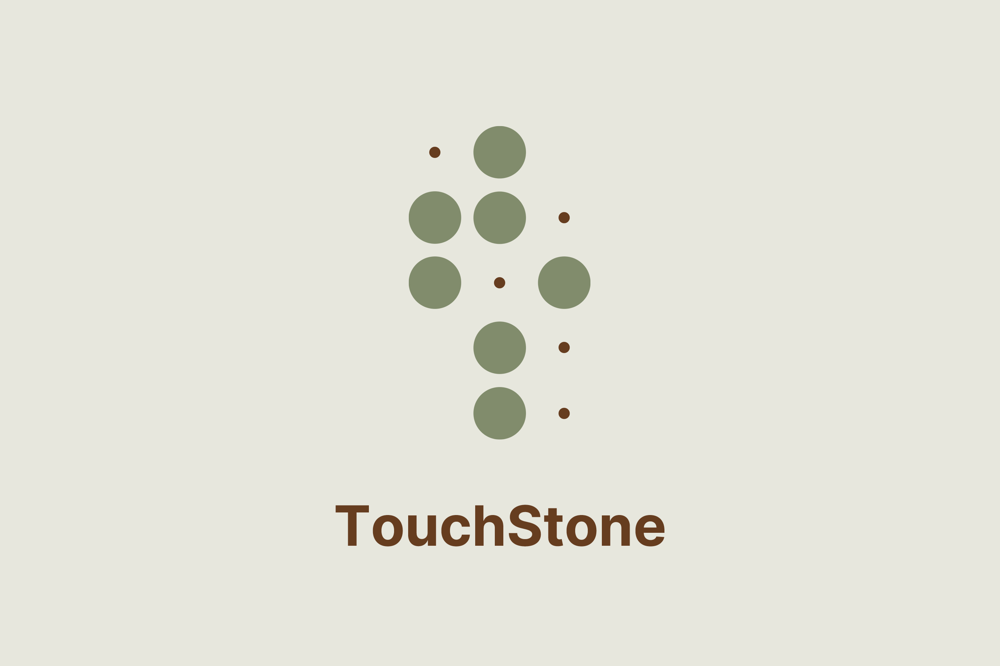
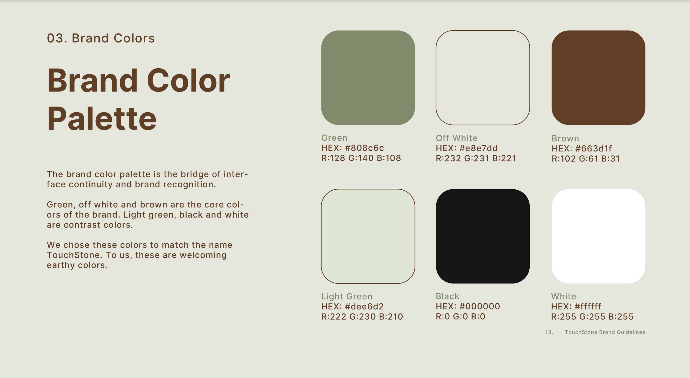
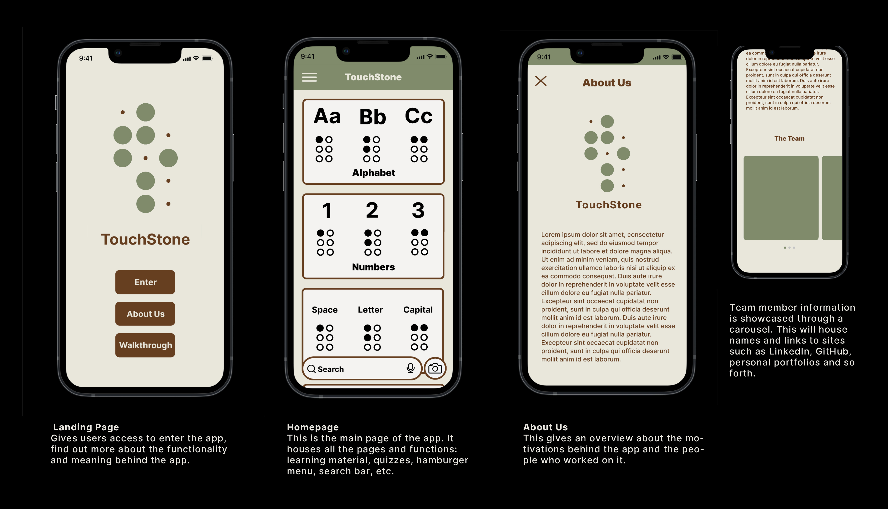
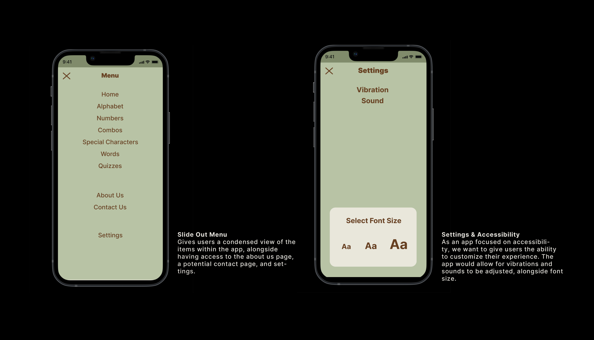
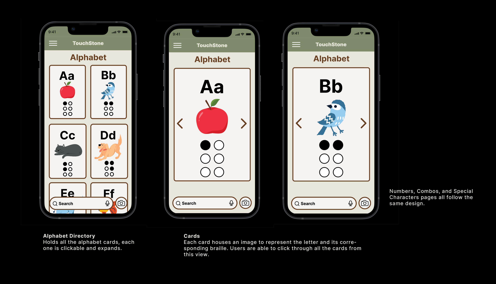
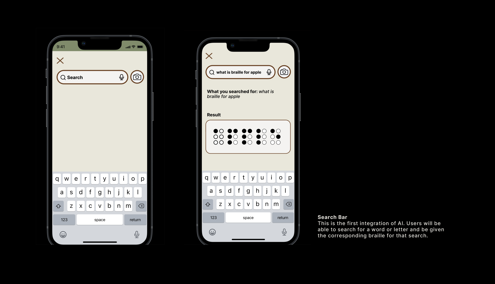
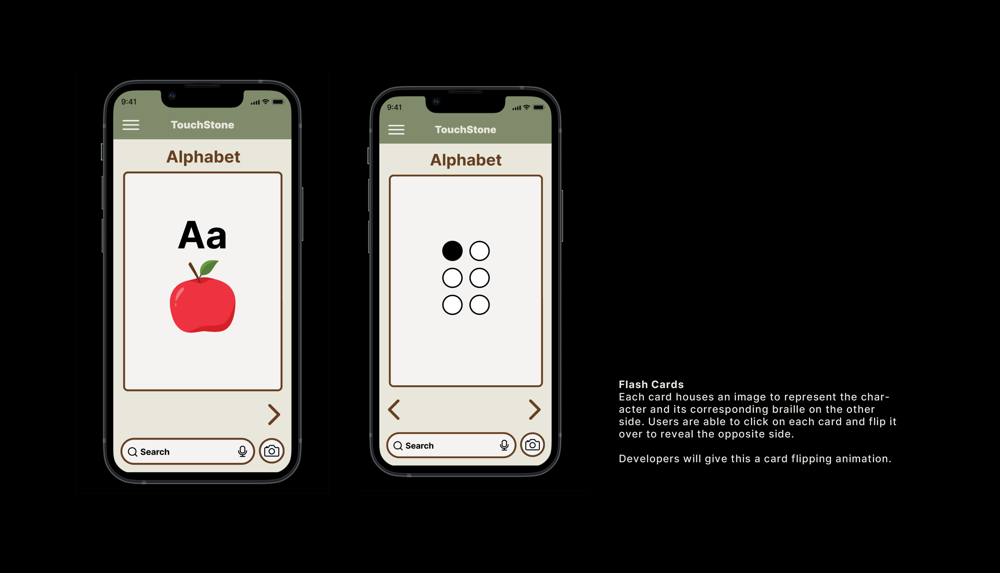
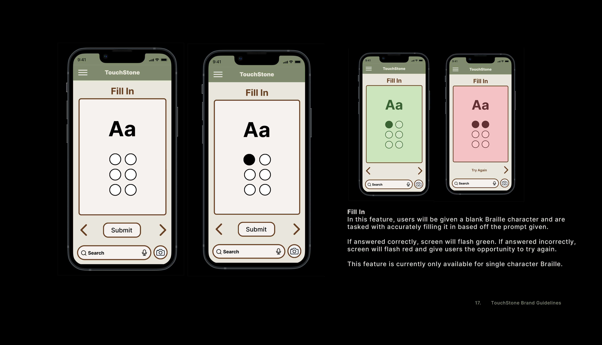
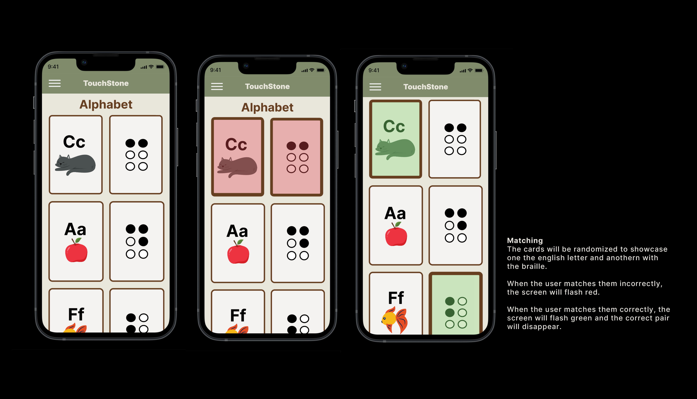

# TouchStone

Explore Braille with TouchStone, a learning app tailored for individuals experiencing vision loss and those curious about Braille. Our platform offers a user-friendly interface and engaging quizzes all while incorporating Gemini AI to answer any query about Braille questions/translations.

## Table of Contents

- [Inspiration](#inspiration)
- [Technologies Used](#technologies-used)
  - [AI](#ai)
  - [Front End](#front-end)
  - [Back End](#back-end)
- [UX/UI & Getting Started](#uxui--getting-started)
- [Development](#development)
  - [Backend](#backend)
  - [Front End Development](#front-end-development)
  - [AI Integration](#ai-integration)
- [Challenges](#challenges)
  - [A.I](#ai)
  - [Braille](#braille)
  - [Project](#project)
- [What We Learned](#what-we-learned)
- [What's Next For TouchStone](#whats-next-for-touchstone)
- [Resources](#resources)

## Inspiration

The inspiration for TouchStone lies behind a shared passion for education and accessibility, alongside our interests in language and communication. Our motivation to create a learning app for Braille stemmed from a memory shared by our peer as they reminisced about their childhood best friend, who happened to be visually impaired. Despite their differences, they formed an inseparable bond exchanging handwritten notes in Braile by poking holes through pieces of paper.

The friend created an entire cheat sheet of Braille representations that they knew in order to preserve that precious connection.

This greatly portrayed the importance of inclusive education and the need for accessible resources for those eager to learn.

We empathize with and recognize a multitude of things: the emotional journey of individuals facing the risk of visual impairment, the overwhelming feelings that come from times of uncertainty and the connection that can stem from learning.

With an enhanced learning experience of instant translations of words and phrases through the integration of AI, TouchStone becomes not only a learning app for those at risk of visual impairment but also a tool to empower educators, parents and caregivers in providing effective support and guidance.

## Technologies Used

### AI

- **Gemini 1.5 Pro**: Utilized for its sophisticated natural language processing abilities, facilitating precise and swift Braille translations throughout our app.

### Front End

- **Vite**: Chosen for its fast builds and hot module replacement to speed up development.
- **React**: Used as the primary framework to build a dynamic user interface.
- **Axios**: Utilized for making HTTP requests to connect with the back end.
- **Dotenv**: Deployed to manage environment variables securely.
- **React-Slick and slick-carousel**: Integrated for creating responsive and flexible carousels.
- **Reactjs-flip-card**: Employed to add interactive flip card components.
- **JavaScript**: The scripting language used to create interactive effects within web browsers.

### Back End

- **Django**: Served as the high-level Python web framework that encourages rapid development and clean, pragmatic design.
- **Psycopg2-binary**: Used as a PostgreSQL database adapter for Python.
- **Django Rest Framework**: Implemented for building powerful and flexible web APIs.
- **Django-cors-headers**: Added to handle Cross-Origin Resource Sharing (CORS), allowing our front end to make secure requests to our API.
- **Python**: The primary programming language for our back-end logic and data processing.

# UX/UI & Getting Started

## Brand Color Pallete



## Main Pages



## Nav bar



## Alphabet Directory & Cards



## Phrases Directory & Cards


## A.I Search Bar



## Quizes

### Flashcards



### Fillin Dots



### Matching



Want to dive deeper? Click the PDF

[Project Overview PDF](src/assets/wireframe/BRANDINGPRESENTATION.pdf)

# Development

## Backend Development

### Technologies Used

For the backend of TouchStone, we chose **Django** and **Python**. Django's robust framework enables rapid development and clean, pragmatic design, making it an ideal choice for our needs.

### Database Seeding

A crucial part of our application is a comprehensive database of Braille characters, which includes English letters and their corresponding Braille images and representations. To achieve this, we created a seeded database that holds all necessary data to facilitate learning and translation within the app. Below is an example of how we populated our database with Braille character information:

```sql
INSERT INTO braille_app_braille ("binary", "english", "braille_img", "category", "learning_img") VALUES
('100000', 'Aa', 'https://i.imgur.com/hSXLUH1.png', 'abc', 'https://i.imgur.com/L4ucI06.png'),
('110000', 'Bb', 'https://i.imgur.com/qRWzRGJ.png', 'abc', 'https://i.imgur.com/M7UaqYF.png'),
...
('001001', '-', 'https://i.imgur.com/JcomJnA.png', '!?.', '');
```

## Front End Development

### Why Vite/React?

We chose Vite/React for our front-end to utilize its rapid development features, such as fast refresh and optimized build times. This technology aligns with our goal to implement a modular and efficient development environment, perfectly suited for adhering to the UX/UI team's Figma designs.

### What Libraries Did We Use?

Our application incorporates several libraries to enhance functionality and user experience:

- **react-burger-menu**: Adds a dynamic, off-canvas sidebar.
- **react-icons**: Provides scalable and customizable icons.
- **react-modal**: Enables accessible modal windows.
- **reactjs-flip-card**: Offers interactive flip cards for engaging user interactions.
- **slick-carousel**: Implements flexible and responsive carousels.

### Functionality

We adopted a component-based architecture to:

- Break down the UI into reusable components, making our codebase cleaner and more maintainable.
- Implement feature by feature on each page, starting with static components and progressively integrating CRUD operations via Axios.
- Utilize Material UI for setting up containers and grids, which helped in structuring the layout according to the design specifications.

## AI Integration

### Why AI?

The decision to incorporate AI into our app was driven by the goal to enhance user interactivity and efficiency. We aimed to streamline the learning process for our users, making it more intuitive and responsive.

### What AI Did We Choose?

We opted for **Gemini 1.5 Pro** for its robust capabilities in processing natural language queries. This choice was made to bolster the functionality of our app's search bar.

### Functionality

**Gemini 1.5 Pro** is integrated within the search bar to curate precise responses. When a user queries a specific Braille character or word, the AI swiftly provides the Braille translation. This functionality not only speeds up the learning process but also ensures accuracy and ease of use, fostering a more engaging learning experience.

# Challenges

### A.I

- We started the project with no prior experience in creating, tuning, and implementing a large language model.
- Navigating through extensive documentation was a challenge, often requiring us to research terminology to fully grasp the concepts, especially when tuning and implementing OAuth.
- We did not foresee the timeframe learning A.I implementation would take.

### Braille

- Finding consistent information when translating letters to braille, different websites would use a unique Braille binary or ASCII code. Coordinating to ensure the team was utilizing the same information.
- Including combination letters to translate words into braille images (expand) Case by case one function implemented in a component to translate letters, numbers and words and detect combination letters.

### Project

- Coming up with an idea that could incorporate A.I, while adding accessibility, having the project be original have a powerful impact in society.

# What We Learned

Developing an app to better serve a specific community such as individuals experiencing vision loss or those eager to learn Braille, presented a significant learning curve. This was our first time diving into the world of accessibility so it required extensive research into Braille’s intricate details.

Additionally, we developed skills in training Vertex and Gemini models and became adept at navigating Google’s documentation. Working closely with the UX/UI team was crucial, as constant communication ensured alignment and cohesive progress.

This process not only advanced our technical capabilities but also deepended our appreciation for teamwork and the critical role of tailored accessibility in technology.

# What's Next For TouchStone

Ensuring that TouchStone is fully accessible remains our primary focus for the app’s next development phase. We plan to support connectivity with portable Braille devices, enabling tactile learners to engage directly throught their smartphones.

Future enhancements for TouchStone include refining our Gemini AI with tuned models and structured prompts for more accurate responses. We are committed to incorporating Responsible AI to ensure these responses are reliable and appropriate.

Additionally, we aim to introduce a camera feature that utilizes OCR technology powered by Google AI. This will allow users to take a picture of a text document and receive instant BRaille translations. We also plan to implement image detection technology so sers can photograph objects and receive their Braille descriptions.

Our ongoing efforts will also focus on improving the accuracy of our Braille translations, ensuring TouchStone continues to meet the needs of our users effectively.
